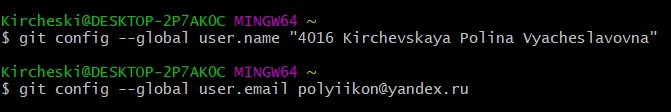
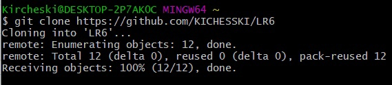
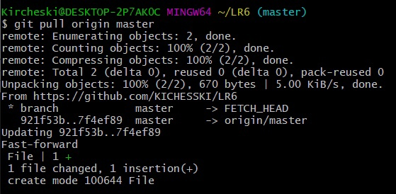
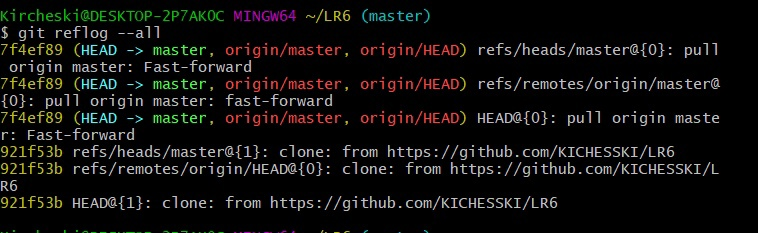
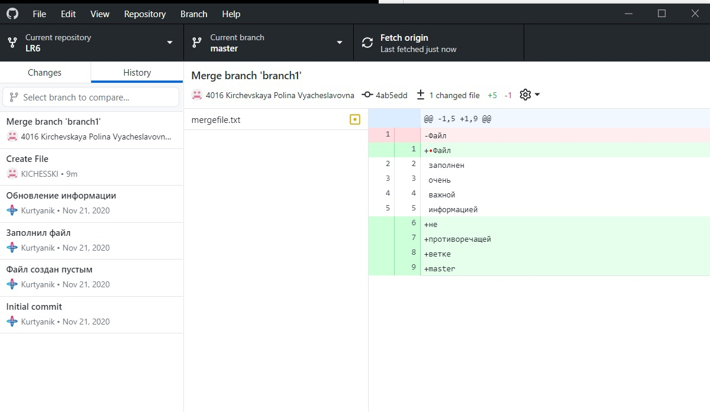
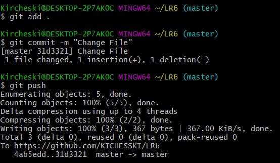
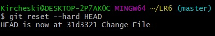
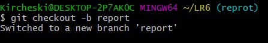
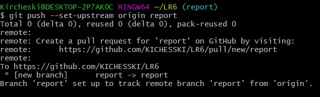

# LR6
Лабораторная работа №6

1. Создаем аккаунт на GitHub и копируем репозиторий https://github.com/Kurtyanik/LR6 в свой аккаунт, устанавливаем Git на компьютер.   
2. Настраиваем клиент.   
   
3. Клонируем репозиторий на компьютер.   
   
4. Добавляем файл File на GitHub и подтягиваем его на компьютер.   
   
5. Получаем историю операций.   
   
6. С помощью GitHubDesktops объединяем ветки master и branch1, затем удаляем branch1.    
   
7. Делаем изменение в файле File и выполняем коммит "Change File".   
   
8. Делаем хард откат.   
   
9. Создаем ветку report для отчета.   
   
10. Загружаем ветку в удаленный репозиторий.   
   
11. Лог команд:   
 git clone https://github.com/KICHESSKI/LR6/   
 git pull origin master   
 git reflog –-all   
 git add .   
 git commit –m "Change File”   
 git push   
 git reset –-hard HEAD   
 git checkout –b report     
 git push –set-upstream origin report   
12. История коммитов:   
commit 31d332118d24559617f8193364e0ffe70161a150 (HEAD -> report, origin/report, origin/master, origin/HEAD, master)    
Author: 4016 Kirchevskaya Polina Vyacheslavovna <polyiikon@yandex.ru>   
Date:   Thu Nov 18 16:14:20 2021 +0300   

    Change File   

commit 4ab5eddd669336b0f8686f761f76452b81d1c40b   
Merge: 7f4ef89 0f9f50d   
Author: 4016 Kirchevskaya Polina Vyacheslavovna <polyiikon@yandex.ru>   
Date:   Thu Nov 18 15:33:21 2021 +0300   

    Merge branch 'branch1'   

commit 7f4ef89656063f26af8b847ef6cd5457227e86d2   
Author: KICHESSKI <94613511+KICHESSKI@users.noreply.github.com>   
Date:   Thu Nov 18 15:24:41 2021 +0300   

    Create File   

commit 921f53b8d0cebf542c791cf31f04e9b792f385a4 (upstream/master)   
Author: Kurtyanik <45309985+Kurtyanik@users.noreply.github.com>   
Date:   Sat Nov 21 20:09:49 2020 +0300   

    Обновление информации   

commit 0f9f50db68a6983b47398017545532cd0f992846 (upstream/branch1)   
Author: Kurtyanik <45309985+Kurtyanik@users.noreply.github.com>   
Date:   Sat Nov 21 20:08:33 2020 +0300   

    Заполнил файл   

commit c08a654a63cfc3a7146b2b7015884d9020f5cbf5   
Author: Kurtyanik <45309985+Kurtyanik@users.noreply.github.com>   
Date:   Sat Nov 21 20:02:16 2020 +0300   

    Файл создан пустым   

commit 3c6e9131bb47ed6009c28226afb0535c7f6d5964   
Author: Kurtyanik <45309985+Kurtyanik@users.noreply.github.com>   
Date:   Sat Nov 21 19:58:20 2020 +0300   

    Initial commit   